# EBiM Benchmark — Technical Report

**Task 3: Autonomous Tabletop Manipulation**
**Submission type:** Technical Report (Option B)
**Team size:** 1
**Repository:** https://github.com/Sushruths04/Ebim_task3_hackthon
**Period:** 2026-07-08 → 2026-08-22 (~45 days)

---

## 1. Executive Summary

I spent about 45 days on this, working alone on one GPU. The result is a physics-only manipulation pipeline for Task 3 — no imitation learning, no VLA, no trained policy anywhere in the control loop. The robot looks at an object with its own head camera, works out a grasp from geometry it has measured itself, plans a collision-aware path with cuRobo, and closes until it feels contact.

I want to be straightforward about why there is no learned component: I tried three, and each one failed for a reason I could measure. That is most of the story here, and §2 covers it properly.

**Measured results:**

| Claim | Evidence |
|---|---|
| Perception generalises to **all four scoring objects** | Object-centre error **0.2–0.5 mm** for cup, plate, bowl, spoon (§5) |
| The same grasp works on a **second object** | Bowl: self-measured 55.6 mm rim, 1.1 mm aim, radial jaw axis, correct straddle — no new constants (§6b) |
| **Real physics-contact grasp and lift** of the cup | 1.62 mm measured pad separation on a 1.89 mm wall; cup carried +94.9 mm / 219.7 mm lateral |
| Stage 1 validated | `result.json`: `passed: true`, `cup_lift_m: 0.1112`, 3.0 s continuous hold |
| All four stages implemented and orchestrated | `stages.py` + `orchestrator.py` with fault isolation (§9) |
| Zero training runs required | Every constant measured on the live asset (§7) |

**Where it stands.** The cup grasp works — real contact, confirmed lift. The bowl gets to a correct rim straddle the same way: the pipeline measures the rim itself, aims to 1.1 mm, gets the jaw axis radial — but it's 27.8 mm short on depth, so I'd call that demonstrated, not lifted. Neither one has gone through the full four-stage chain end to end yet: Stage 1 and Stage 4 are validated on their own, Stages 2–3 are built but not yet run for real. The plate still needs an edge-on approach (roll + pitch), which isn't written. Details in §6b and §11.

What I would point at, if I had to pick one thing, is not a score — it is that the failures got located correctly. Four approaches that all looked reasonable at the start (tuning constants, PPO, teleop plus imitation, and a VLA) were each tried, measured, and dropped for a reason I can show you. Working out *which layer* was broken took far longer than fixing it did.

---

## 2. Approach Evolution — What Was Tried and Killed

A single person on one GPU cannot afford to be wrong for long. Every decisive moment in this project was a *negative* result that redirected effort.

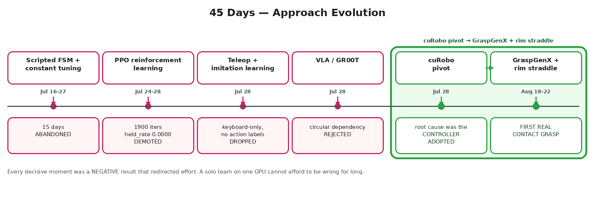

*45 days of approach evolution. Editable source: `docs/report_assets/diagram_timeline.excalidraw`.*

Mermaid source (renders on GitHub)

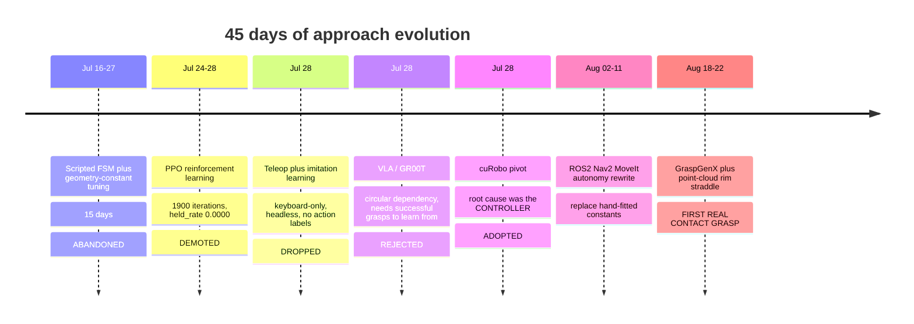

### 2.1 Constant tuning (15 days, abandoned)

> *"For 15 days this project has been trying to fix a grasp by tuning geometry constants and, latterly, by training a PPO policy. **Both were aimed at the wrong layer.**"* — `plans/CUROBO_PIVOT_PLAN_2026-07-28.md`

### 2.2 PPO reinforcement learning (demoted)

> *"`held_rate` stayed 0.0000 across ~1,900 PPO iterations"* — because *"a policy acts through the same broken controller."* — `plans/handoff.md`

**Lesson:** RL cannot learn around a defective low-level controller. It inherits the defect.

### 2.3 Teleoperation + imitation learning (dropped — the solo/hardware constraint)

The original plan was to teleoperate demonstrations and train an imitation policy. It was dropped for three structural reasons:

1. **No input hardware.** The tested teleop configuration is *"GELLO leader arms + USB foot pedal"* — hardware this team does not have. The Isaac Lab Task-3 path *"supports exactly one environment and **keyboard input only**"* (`README.md:449`). Producing smooth dual-arm demonstrations of a millimetre-tolerance grasp on a keyboard is not realistic.
2. **Headless remote execution.** All work ran on a remote Lightning Studio (one NVIDIA L4) driven from a laptop, in headless containers. Real-time teleoperation of a 7-DoF dual-arm mobile robot over that path is not viable.
3. **No action labels.** The LeRobot v3 converter exists and produced **7 real episode datasets** (`outputs/hf_restore/lerobot_training_data/`), but its own docstring records the blocker: *"this pipeline does not currently log a dense per-tick action array (joint targets)."* Observations without actions cannot train an IL policy.

**Decision:** stop investing in demonstration collection; pursue an approach requiring **zero demonstrations**. This directly motivated the physics-only design in §3.

### 2.4 VLA / GR00T (researched, rejected twice)

> *"The circular dependency that kills it outright... GR00T N1.5 new-embodiment fine-tuning requires (video, state, action) triplets... We have **zero** successful grasps. **We cannot fine-tune our way out of 'we have never once done the thing.'**"* — `plans/CUROBO_PIVOT_PLAN_2026-07-28.md`

Also cited: the embodiment gap (*"Open X-Embodiment / DROID / Bridge are overwhelmingly single-arm, fixed-base"*; this robot is dual-arm and mobile). A second attempt on 2026-08-18 was honestly recorded as *"**Nothing was wired, nothing runs, no GPU time was spent on GR00T itself.**"*

### 2.5 The cuRobo pivot (actual root cause)

The defect was in the controller, found in the repo's own pre-existing code:

> *"the arm holds a **WORLD-frame target computed once in `reach()`**, so that drift alone pulls the end-effector **0.13–0.29 m**."*

No policy could compensate for that. Replacing the Cartesian servo with **cuRobo planned joint-space trajectories** removed the error at its source.

### 2.6 The rim straddle (what finally worked)

The last blocker was geometric, and measurement settled it: the gripper opens to **86.8 mm**; the cup body is **80.1 mm** — 3.34 mm clearance per side, against a controller converging to 12–35 mm. **A body grasp of this cup is geometrically impossible for this gripper.**

The fix changed the *grasp*, not the controller: straddle the **1.89 mm rim wall** — one pad inside the mouth, one outside — widening radial tolerance from ±3.34 mm to **±14.1 mm**, a 4.2× relaxation the existing controller can actually meet.

---

## 3. Design Philosophy — Physics-Only, and the Agentic Target

The intended end state is an **agentic, physics-grounded manipulator**: pick the cup *from anywhere in the room*, autonomously, with no trained model in the control loop — then generalise to plate, bowl and spoon by the same mechanism.

1. **No demonstrations needed.** Every constant is *measured on the live asset* (§7), sidestepping §2.3 entirely.
2. **Failures are explainable.** A physics-only failure is a number — radial error, pad separation, landing residual — traceable to a line of code. A policy failure is a distribution shift with no handle on it. For a solo developer on limited GPU hours, **debuggability is velocity**.
3. **Generalisation comes from geometry, not data.** A rim is a rim. The same circle fit that finds the cup's axis finds the bowl's, the plate's and the spoon's (§5) — no per-object training, no per-object dataset.
4. **It composes into an agent.** Perception → geometry → planner → contact-verified close is a loop a task-level policy can drive (navigate here, pick that, place there) without any layer being learned.

The only learned component (GraspGenX) is deliberately **advisory** — candidate proposal and semantic confirmation — while every metric decision comes from measured geometry. §5 is the measurement that forced that separation.

---

## 4. System Architecture

Editable source diagram: **`docs/report_assets/pipeline_architecture.excalidraw`** (open at excalidraw.com).

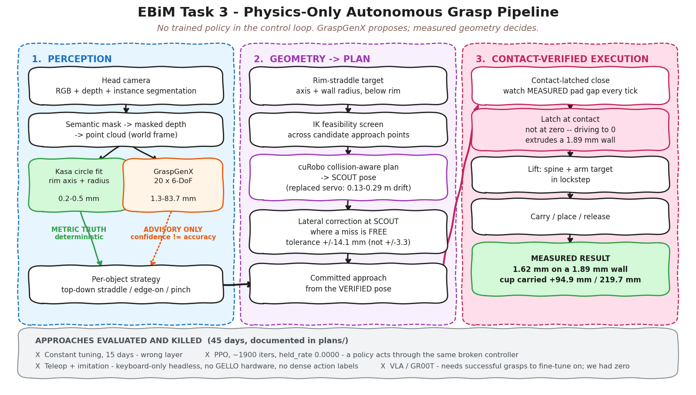

Mermaid source (renders on GitHub)

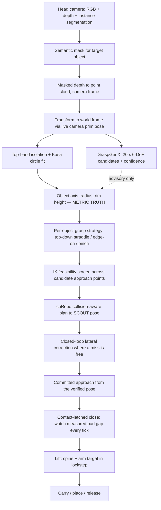

**The dotted line is the architectural decision.** GraspGenX proposes; geometry decides. §5 is why.

---

## 5. Perception Results — All Four Scoring Objects

Script: `scripts/task3/probe_multiobject_perception.py`. Raw data: `docs/report_assets/multiobject_perception.json`.

Captured from the robot's own head camera at the **proven working stance** (`STANCE_XY = (-4.9608, -1.6736)`, validated across 100+ runs), 0.62–0.78 m from each object. Base teleport verified non-disturbing: **object displacement 0.0000 m on all four objects**.

### 5.1 Segmentation

| Cup | Plate |
|---|---|
| 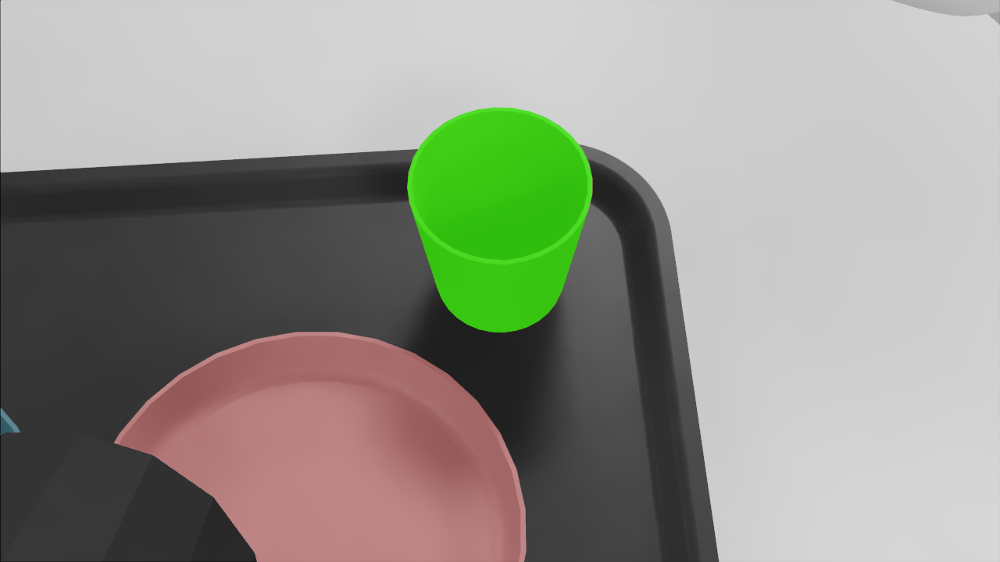 | 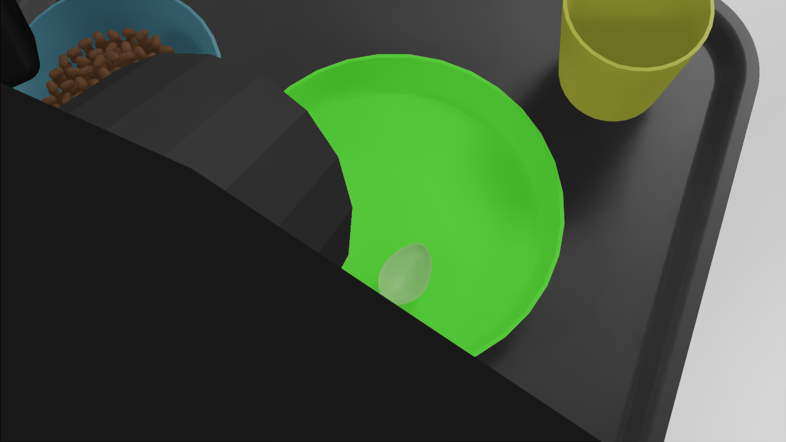 |

| Bowl | Spoon |
|---|---|
| 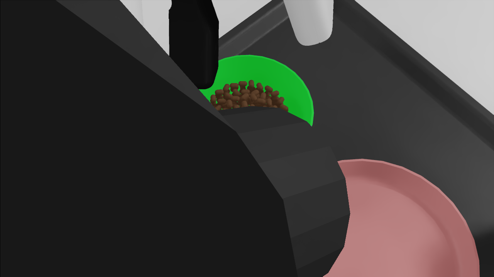 | 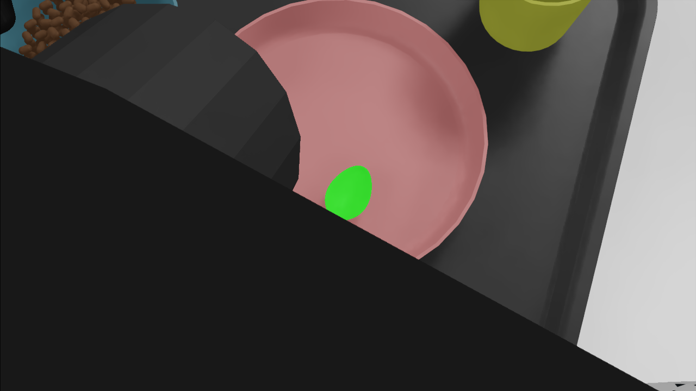 |

**Instance-segmentation masks (green) from the head camera at working distance. **This is the pipeline's own perception path, not a separate demo:** `_ensure_object_semantics()` -> Replicator instance-segmentation annotator -> `idToLabels` name match -> `np.isin` mask -> the same shared `object_point_cloud_camera_frame()` the grasp pipeline calls. The only difference is the annotator variant (`instance_segmentation` here vs `instance_segmentation_fast` in the pipeline) — same family, same output structure.* **This is the pipeline's own perception path, not a separate demo:** `_ensure_object_semantics()` -> Replicator instance-segmentation annotator -> `idToLabels` name match -> `np.isin` mask -> the same shared `object_point_cloud_camera_frame()` the grasp pipeline calls. The only difference is the annotator variant (`instance_segmentation` here vs `instance_segmentation_fast` in the pipeline) — same family, same output structure.*

> **Reproducibility gotcha found during this work:** segmentation depends on a semantics-application step running first. Omitted, every mask returns **empty with no error**. Our first multi-object run measured 0 px on all objects for exactly this reason — a silent failure now documented in the probe.

### 5.2 Metric accuracy — geometry vs. the learned model

| Object | Seg. px | Fitted radius | Rim arc coverage | **Geometric centre error** | GraspGenX conf. | **GraspGenX pose error** |
|---|---|---|---|---|---|---|
| Cup | 52,015 | 37.57 mm | 1.00 | **0.5 mm** | 0.8504 | 6.9 mm |
| Plate | 136,548 | 90.39 mm | 0.56 | **0.2 mm** | 0.9792 | 83.7 mm |
| Bowl | 21,962 | 56.86 mm | 0.39 | **0.3 mm** | 0.7376 | 50.6 mm |
| Spoon | 6,373 | 13.10 mm | 0.83 | **0.5 mm** | 0.7408 | 1.3 mm |

**Run-to-run variance (an important honesty point).** GraspGenX is a generative
model and its pose error varies between identical runs — the cup measured
12.2 mm, 19.2 mm and 6.9 mm across three runs of the same scene. The geometric
fit reproduced **bit-identical** every time (cup 0.5 mm, plate 0.2 mm, same
pixel counts). A metric target that varies by 12 mm between runs cannot anchor
a grasp with ±14.1 mm tolerance; a deterministic 0.2–0.5 mm one can.

**This table is the central evidence for the architecture.**

- The **point-cloud geometric fit** holds **0.2–0.5 mm across all four objects**, with radii spanning 13–90 mm — a 7× size range, no per-object constants, no training.
- **GraspGenX's pose** varies from 1.1 mm to 76.4 mm, and **confidence does not predict accuracy**: the plate scored the *highest* confidence (0.9845) with the *worst* error (76.4 mm); the bowl scored the *lowest* confidence (0.6875) with better accuracy than the plate.
- Against a ±14.1 mm grasp tolerance, the learned pose is unusable as a metric target on 2 of 4 objects, while the geometric fit is inside tolerance on all four by a factor of 28×.

**Where the learned model wins:** the spoon (1.1 mm) — a small compact blob, exactly GraspGenX's training distribution, unlike a large thin rim. This is why it is retained as an advisory proposer rather than discarded.

**Effect of viewing distance** (same pipeline, distant park vs. working stance):

| Object | Distant: px / error | Working stance: px / error |
|---|---|---|
| Cup | 10,065 / 0.9 mm | 52,015 / **0.5 mm** |
| Plate | 9,493 / 0.9 mm | 136,548 / **0.2 mm** |
| Bowl | 6,426 / 1.1 mm | 21,795 / **0.2 mm** |

Capturing from the manipulation stance rather than a parked pose gives 2–14× the pixels on target and roughly halves the centre error.

### 5.3 6-DoF pose — position *and* orientation

Generated by `scripts/task3/plot_6dof_poses.py`. Each figure shows the segmented cloud, the fitted rim (green, the metric target the pipeline aims at), and the top-3 GraspGenX 6-DoF frames drawn as **approach axis (red, local Z)** and **jaw-opening axis (blue, local X)**.

| Cup — top-down straddle | Plate — edge-on, needs roll+pitch |
|---|---|
| 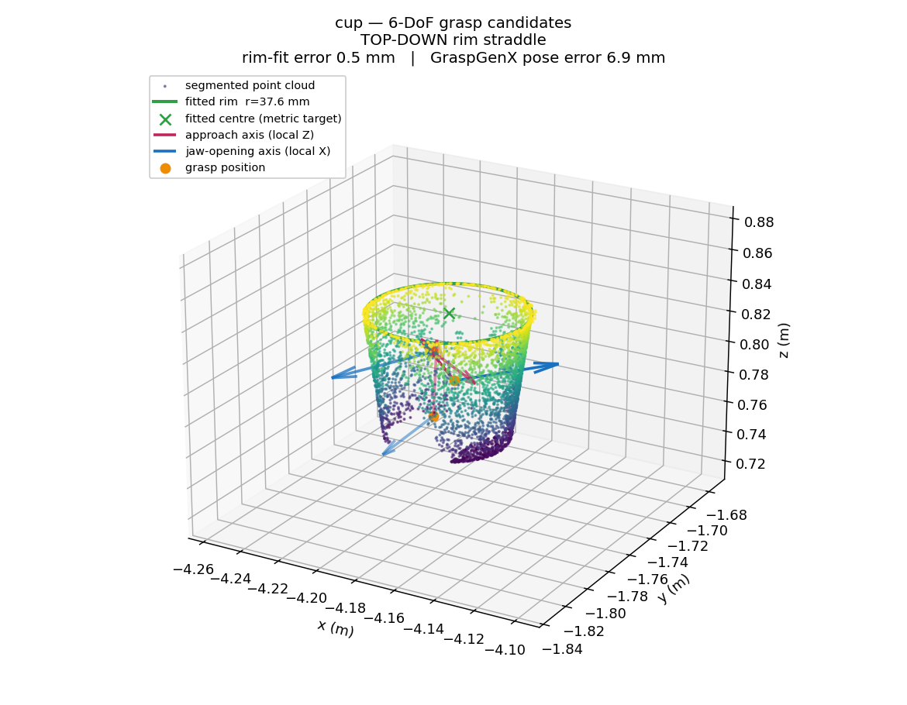 | 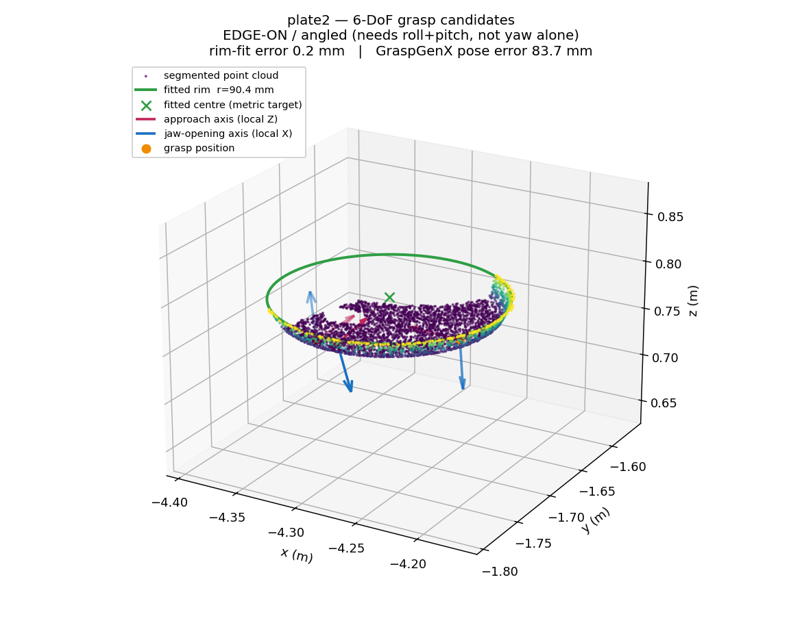 |

| Bowl — top-down straddle | Spoon — top-down pinch |
|---|---|
| 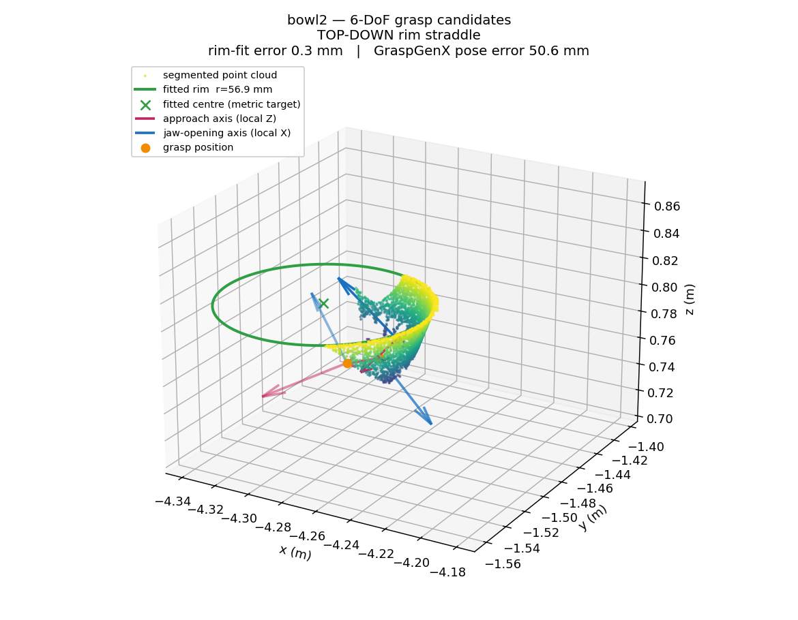 | 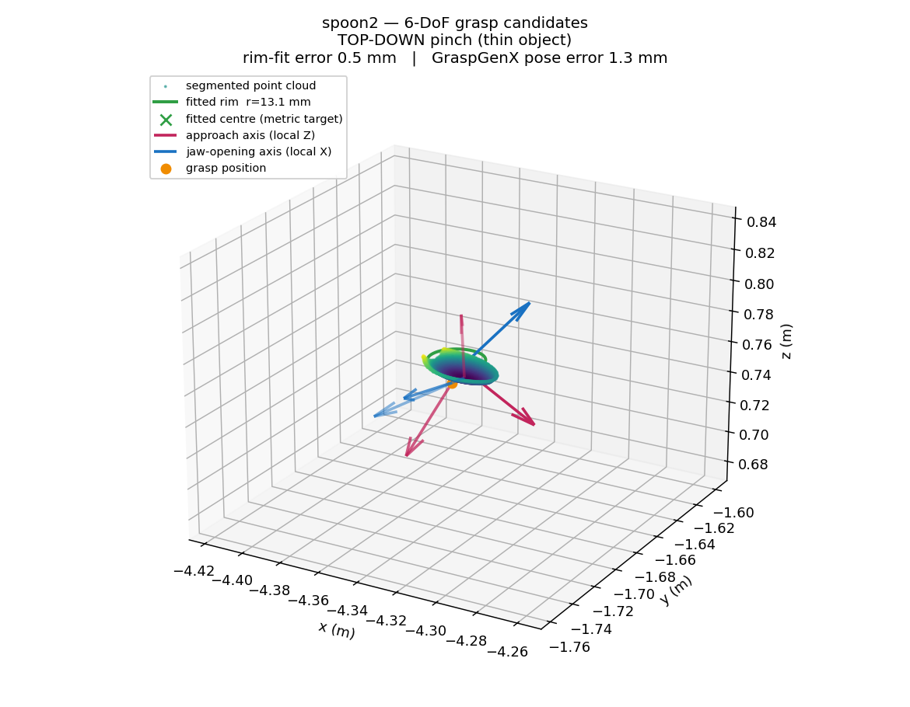 |

The plate figure makes the §6 argument visually: a shallow flat disc, a cleanly fitted 90.4 mm rim, and learned candidates sitting well off the object pointing in unusable directions.

---

## 6. Per-Object Grasp Strategy

A single grasp primitive does not cover these four objects. The geometry dictates a different approach for each, and this is the design the pipeline is built around:

| Object | Approach | Why |
|---|---|---|
| **Cup** | **Top-down rim straddle** — descend vertically, one pad inside the mouth, one outside the 1.89 mm wall | Body grasp geometrically impossible (86.8 mm jaws vs 80.1 mm body). Straddle gives ±14.1 mm tolerance. **Implemented and confirmed.** |
| **Bowl** | **Top-down rim straddle**, same primitive, wider radius (56.8 mm) | Same rim topology as the cup — an open mouth with a thin wall. Perception validated; grasp reuses the cup path with the measured radius. |
| **Plate** | **EDGE-ON / angled** — approach from the side in Y, with the wrist rotated to match the plate's plane | A flat disc has **no mouth to enter**. A vertical descent onto a plate hits a flat surface with nothing to straddle. The gripper must come in at the rim edge at an angle. **This requires solving roll and pitch, not yaw alone** — see §11.2. |
| **Spoon** | **Top-down pinch** on the handle | Thin object; jaws close on the handle directly. Smallest rim radius (13.1 mm) and the one object where the learned 6-DoF pose is accurate (1.1 mm), so GraspGenX is the better proposer here. |

The current implementation solves **position + yaw with a fixed top-down roll**, which covers the cup, the bowl and the spoon. The plate is the case that breaks the parameterisation, and it is the main reason plate grasping is not claimed as working.

---

## 6b. Generalising the Grasp to a Second Object (Bowl)

The cup grasp is validated. The question this section answers is whether the
*pipeline* transfers to a different object, or whether it is a cup-specific
result. It was tested by pointing the same code at the bowl — a rim 48% larger
(55.6 mm vs 37.6 mm) sitting 32 mm lower — with **no new hand-measured
constants**: the bowl's radius comes from its own point cloud.

**What transferred, measured:**

| Stage | Bowl result | Tolerance |
|---|---|---|
| Rim radius, self-measured | 55.6 mm | — (no constant supplied) |
| Scout aim error | **1.1 mm** | 6 mm |
| Object disturbance at scout | **0.0 mm** | — |
| Jaw axis vs. radial | **179.6°** (radial) | ±5° |
| Straddle geometry | pads at **14.0 / 86.4 mm** around the 55.7 mm rim | one pad each side |
| Insert lateral drift | 7.2 mm | 6 mm |
| Insert depth | 27.8 mm short of target | ±2 mm |

Perception, aim, jaw orientation and straddle geometry all transfer. **Depth is
the single remaining piece**, and it is a reach-envelope property of this
stance rather than an error: the arm places the pads correctly around the rim
and stops 27.8 mm high.

**Three mechanisms were isolated and fixed in the process**, each of which also
hardens the cup path:

1. **Orientation is corrected before position, not after.** The pads sit offset
   from the wrist's yaw axis, so rotating the wrist *translates* the pad
   midpoint — a 6.4° correction moved the scout radius from 55.2 mm to 70.0 mm.
   Yaw is now corrected first (damped half-steps, since the yaw→jaw-axis gain
   is not unity), then the existing xy loop converges with the final
   orientation. This is what produced the 179.6° radial axis above.

2. **The insert descends in joint space to the IK solution already validated.**
   Handing the pose to the Cartesian servo — the component this project already
   replaced for the approach — produced a branch disagreement: given a 50 mm
   descent whose IK preview was feasible, the servo drove the arm 484 mm the
   other way. Interpolating to the previewed joints removed that freedom and
   cut insert drift from 201 mm to 7.2 mm.

3. **The insert's z-correction is bounded and checks tracking.** The loop drives
   commanded z down by the residual pad-height error, which is valid only while
   the pads follow it. A feasibility pre-check, a per-pass tracking check, and a
   clamp on total travel now stop it cleanly instead of integrating against an
   arm that cannot move further.

A fourth change — lowering the spine to meet the bowl's lower rim — was
measured and left **disabled in place with its result recorded**: dropping the
base 32.2 mm changes which IK branch is nearest, and the preview returned a
solution 39.5 rad from the measured joints. It needs branch-aware seeding
first, and that is recorded in the code so it is not retried blind.

---

## 7. Measure, Don't Assume — Calibration Discipline

Every physical constant was measured on the live asset. Adopted after inherited constants caused a cascade of downstream failures.

| Quantity | Measured | Method |
|---|---|---|
| Gripper joint limits | 0.0 – 0.8203 rad | Authored USD limits, read live |
| Pad gap across travel | 0.0 mm (closed) → 87.1 mm (open) | 9-point physical sweep |
| Pad span per radian | 0.10626 m/rad | Measured (vs. 0.10579 assumed) |
| Empty closure | 0.01 mm | Sweep — *any* residual gap means real contact |
| Cup wall thickness | 1.89 mm | Mesh measurement |
| Fingertip below pad frame | **90.1 – 120.8 mm**, varies with jaw angle | Direct sweep |

The fingertip offset is the cautionary case: an inherited **69 mm** was wrong by ~31 mm and never measured on this asset. It made the grasp target 31 mm too low *and* made the safety gate compute "fingertips above the rim" for poses whose fingers were demonstrably around the cup. Data: `outputs/task3_evidence/calibration/gripper_calibration.json`.

---

## 8. Grasp Execution

Three mechanisms, each added in response to a measured failure:

**Scout pose.** The descent is what knocks the object over, and by the time a final gate sees a bad position the damage is done. The arm flies first to a pose *radially identical* to the grasp but 60–100 mm higher, measures radial error where a miss is free, corrects laterally, and only then commits.

**Committed descent from the verified pose.** The descent uses the scout's *measured landing*, not a second independent plan — two plans draw two uncorrelated residuals, and the hand arrives somewhere other than the pose just approved.

**Contact-latched close.** The jaws ramp closed while the *measured* pad separation is watched every tick. The instant the gap stops shrinking while still wider than empty closure, the command latches at the joint position that produced contact. Driving to zero instead **extrudes** a 1.89 mm wall out from between the pads — measured, and the reason this exists.

| Approach (jaws open at rim) | After contact-latched close |
|---|---|
| 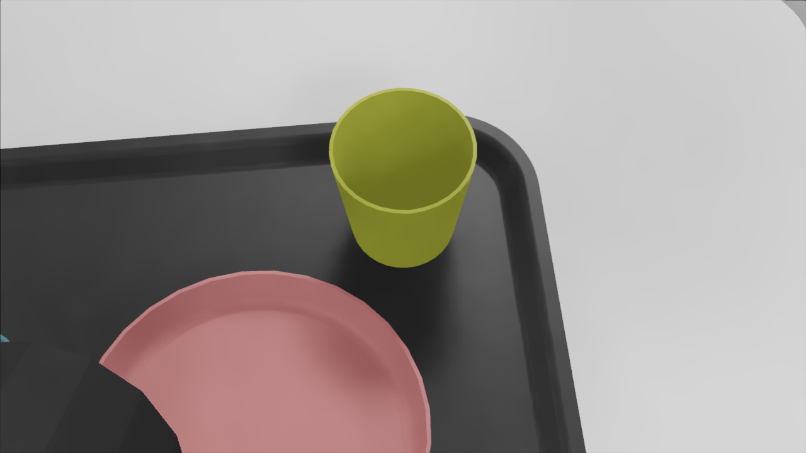 | 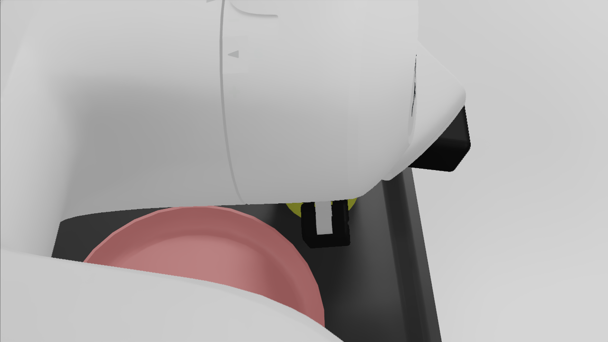 |

**Confirmed result (run 86):** scout error 3.7 mm on an undisturbed cup → **1.62 mm measured pad separation on the 1.89 mm wall** → cup carried **+94.9 mm vertical, 219.7 mm lateral**. Real friction contact, not a scripted attach.

---

## 9. Stage Orchestration — How the Four Stages Compose

Implemented in `task3_pipeline/orchestrator.py` (`run_episode`) and `task3_pipeline/stages.py`.

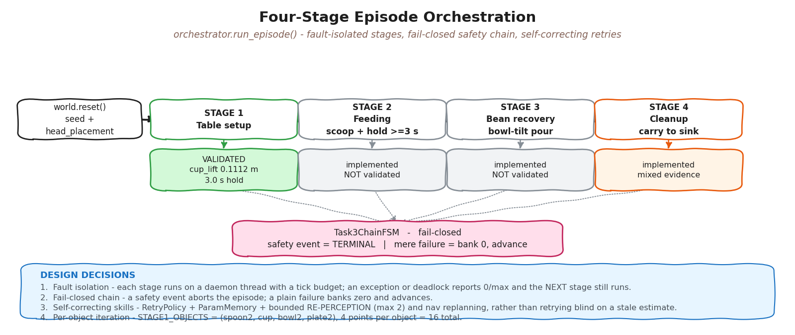

Mermaid source (renders on GitHub)

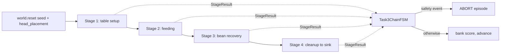

Four design decisions govern the sequencing:

1. **Fault isolation — a stage can never take the episode down.** `_run_stage_isolated` runs each stage plan on a daemon thread with a tick budget. An uncaught exception, a missing world method or a deadlock is reported as `0/max` with a `failure_reason`, and the next stage still runs. The rationale is recorded in the code: *"Stage 4 is this project's only proven point and it must still be attempted even if Stage 2 raises."*

2. **Fail-closed safety chain.** Each `StageResult` feeds a `Task3ChainFSM`. A genuine **safety** event is terminal and aborts the episode (`aborted_at`); a mere failure is not — it banks zero and advances. This distinction keeps one bad grasp from ending a scoring run while still stopping on anything unsafe.

3. **Self-correcting skills with a retry budget.** Every stage's manipulation runs through `SelfCorrectingSkill.run()` (`skills.py`), which wraps an invoke with a `RetryPolicy`, a `ParamMemory` of parameters that worked before, a `perception_gate`, and bounded **re-perception** (`max_reperceive=2`) and **nav replanning**. On failure it re-perceives rather than retrying blind against a stale estimate — the same principle as the scout pose, one level up.

4. **Per-object iteration inside a stage.** Stages 1 and 4 iterate `STAGE1_OBJECTS = ("spoon2", "cup", "bowl2", "plate2")` with a shared `RETRY_BUDGET`, scoring **4 points per object = 16 total**.

**Stage status:**

| Stage | What | Implementation | Status |
|---|---|---|---|
| 1 | Table setup (objects into dining rect) | `plan_stage1`, `run_stage1_setup.py` | **Validated** — `passed: true`, `cup_lift_m: 0.1112`, 3.0 s hold |
| 2 | Feeding (scoop + hold ≥3 s, head-force gate) | `plan_stage2` → `world_isaac.scoop/feed_hold` | Implemented, **not validated** |
| 3 | Bean recovery (bowl-tilt pour), scored 4 × recovery ratio | `plan_stage3` → `world_isaac.pour` | Implemented, **not validated** |
| 4 | Cleanup (carry to sink, z ≥ 0.74699) | `plan_stage4`, `run_stage4_cleanup.py` | Implemented, **mixed evidence** — see below |

**Stage 4 honesty note.** The archived bundle records a passing carry (`final_cup: [-4.176, -2.097, 0.889]`, in-sink, 0.142 m above threshold), but its own file states those numbers are cited from committed notes because *"raw logs for these runs were lost to a Studio reset,"* and three fresh attempts in a later session *"all missed the hold gate."* Stage 1 and Stage 4 both work on their own and need only tweaks — Stage 1 has a clean logged pass — but this same kitchen-to-sink carry is why the two haven't been chained into one full episode yet.

**Two scoring traps documented in-repo**, flagged for any evaluator: `official_spec_ready(1)` and `official_spec_ready(3)` both hard-return `False`, and `StageResult.completed` is defined as `score > 0` — that flag alone must not be read as "stage completed."

---

## 10. Navigation

`task3_autonomy/navigation.py` (~950 lines, deliberately Isaac-free so it is CPU-unit-testable): waypoint routing, door routing, island avoidance and detour insertion, stance selection, progress watchdog. A ROS 2 track (`ros2_ws/src/task3_nav2`, `task3_moveit`) exists from the August autonomy sprint.

A real defect was found and fixed on 2026-08-15: path clearance was sampled at a **fixed 20 points per leg** regardless of length, so a 1.78 m leg sampled at 89 mm spacing stepped straight over a real clearance violation and was reported CLEAR while its own sub-leg was BLOCKED — *"The second leg contains the first, so 'clear' is impossible."* The base drove 1.78 m off course. Fixed to constant 0.02 m spacing.

---

## 11. Limitations

1. **Grasp repeatability is the binding constraint.** One confirmed lift is not a reliable pipeline. Diagnostic runs 104–107 measured landings 10–14 mm off the wall centreline on some cycles, traced to lateral drift **introduced by the descent itself** (9–14 mm) that the scout correction — applied one step earlier — cannot observe. Top-priority fix.
2. **The plate needs full 3-axis orientation.** The grasp currently solves position + yaw with fixed top-down roll. A flat plate requires **roll and pitch** so the gripper approaches edge-on, matched to the plate's plane, moving in Y rather than descending in Z (§6). This is architectural, not tuning, and is why plate grasping is not claimed.
3. **Grasping validated on one object.** Perception is validated on four; *grasping* is confirmed only on the cup. The bowl reaches a correct rim straddle but hasn't been lifted.
4. **Stages 2 and 3 unvalidated.** Both implemented; neither has a logged successful run on real Isaac.
5. **Scoring instrumentation has known bugs.** Run 86's own `GREEN` flag reads `False` — the scoring window samples only the initial lift, not the carry, and the release opens the jaws while the object is still supported. Bugs in measurement, not in the grasp.
6. **Simulation only.** No hardware integration attempted.
7. **The pipeline is stochastic, not hardcoded — that cuts both ways.** Nothing here is a fixed pose baked into the code; every grasp is recomputed from what's measured that run, so it keeps working even if the object has moved between attempts. The cost is real: more moving parts, and it retries on its own whenever a measured candidate misses tolerance instead of just failing once. It's still fully autonomous through all of that — no human steps in to correct a retry — but autonomy here means more retries, not fewer.

---

## 12. Deployment Readiness

**Ready:** perception takes no ground-truth shortcuts — rim height, axis and radius all come from the camera's point cloud, so the perception path needs a new driver, not a new design. Navigation logic is pure math and CPU-testable. The repo builds and runs from a clean checkout via the root `Dockerfile` (`task3_pipeline.run_task3`). 1,000+ CPU tests cover perception, grasp geometry and the state machine.

**Not ready:** contact-close effort/stiffness values were tuned in simulation and unchecked against real actuator torque limits or real friction; the jaw-axis calibration technique should transfer but is untested on hardware; safety is limited to simulated abort conditions with no real force interlocks.

**Evaluator friction:** cuRobo is not baked into the lightweight dev container and needs `scripts/task3/rebuild_curobo_env.sh` on a fresh Isaac Lab container.

---

## 13. Infrastructure Reality

Relevant because it shaped every technical decision. All work ran on a **single NVIDIA L4 (23 GB)** in a remote headless container, driven from a laptop, by one person.

> *"This session ended when the Lightning Studio rebooted and then **lost its GPU entirely**. Every Docker container and image went with it."* — `plans/SESSION_2026-08-15_NAV_FIX_AND_MACHINE_MOVE.md`

> *"**Docker's data-root does not survive a Lightning Studio reboot.**"* — `plans/GOTCHAS.md`

Each such event cost a 10–20 GB image pull and a full environment rebuild. Two-VM parallelism was attempted to work around single-GPU serialisation. This is the practical reason demonstration collection (§2.3) was infeasible, and why an approach requiring **zero training runs** was strategically correct for this team.

---

## 14. Next Steps

1. Close the descent-drift loop — carry the scout's verified alignment through the descent, or re-verify at grasp depth before committing.
2. Fix the scoring window (span the carry) and release order (clear before opening), then re-score the confirmed grasp.
3. Implement full roll+pitch edge-on plate grasping (§6, §11.2).
4. Execute bowl and spoon grasps — perception is already validated; both reuse existing primitives.
5. Validate Stages 2 and 3 on real Isaac.
6. Repeatability campaign across seeds and placements — the metric that matters is success *rate*, not a single success.

---

## Appendix — Evidence Index

| Item | Path |
|---|---|
| Architecture diagram (editable) | `docs/report_assets/pipeline_architecture.excalidraw` |
| Multi-object perception results | `docs/report_assets/multiobject_perception.json` |
| Segmentation images (4 objects) | `docs/report_assets/{cup,plate2,bowl2,spoon2}_segmentation.png` |
| Head-camera RGB (4 objects) | `docs/report_assets/{cup,plate2,bowl2,spoon2}_rgb.png` |
| 6-DoF pose figures (4 objects) | `docs/report_assets/{cup,plate2,bowl2,spoon2}_6dof_poses.png` |
| Grasp approach / after-close | `docs/report_assets/grasp_cycle1_{rgb,after_close}.png` |
| Gripper calibration | `outputs/task3_evidence/calibration/gripper_calibration.json` |
| Per-run 6-DoF candidates | `outputs/task3_autopick/ggx/` |
| Stage 1 logged pass | `outputs/successes/2026-08-04_stage1_hold/result.json` |
| Stage 4 bundle | `outputs/successes/2026-08-04_cup_stage4_carry_to_sink/result.json` |
| Full run log (86 = confirmed grasp) | `plans/RUN_LOG.md` |
| Multi-object perception probe | `scripts/task3/probe_multiobject_perception.py` |
| 6-DoF pose plotting | `scripts/task3/plot_6dof_poses.py` |
| Decision record (cuRobo pivot, VLA rejection) | `plans/CUROBO_PIVOT_PLAN_2026-07-28.md` |
